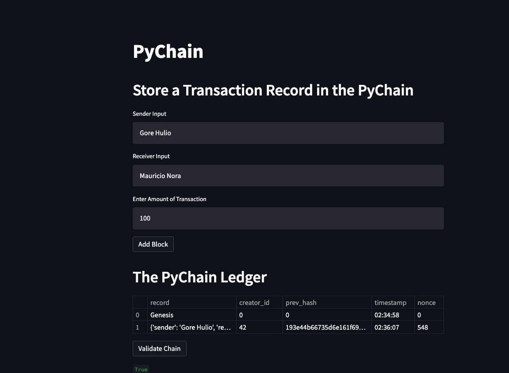
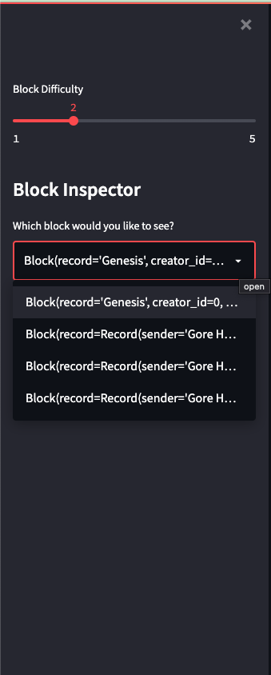
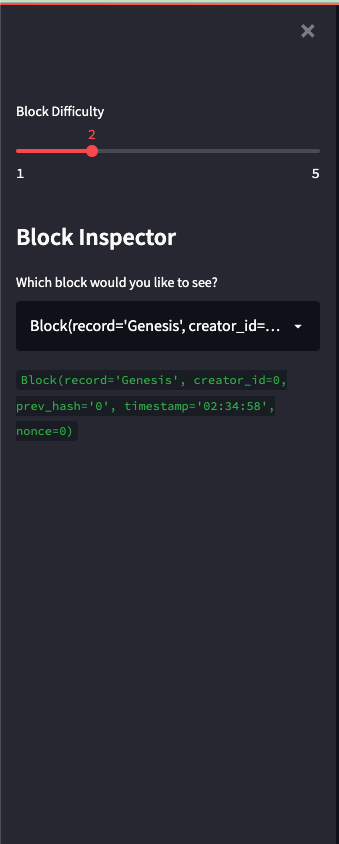
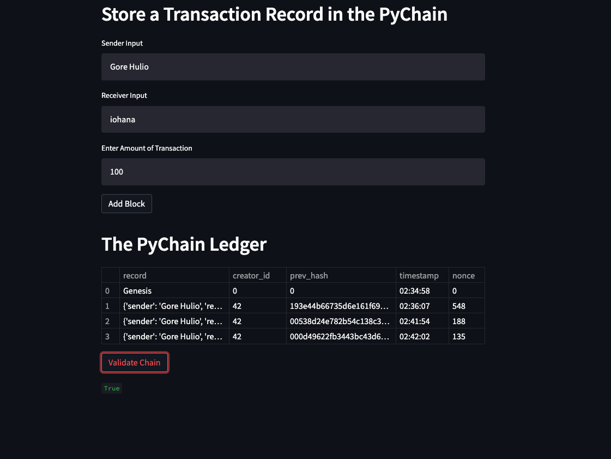

# Blockchain-Building-Blocks

## Homework Objectives:

1. Create a new data class named Record. This class will serve as the blueprint for the financial transaction records that the blocks of the ledger will store.
2. Modify the existing Block data class to store Record data.
3. Add Relevant User Inputs to the Streamlit interface.
4. Test the PyChain Ledger by Storing Records.

## Homework Outcomes:

**Add Transaction to Blockchain**
---

**Block Inspector Dropdown**
---

**Block Inspector Output**
---

**Validate Blockchain**
---
